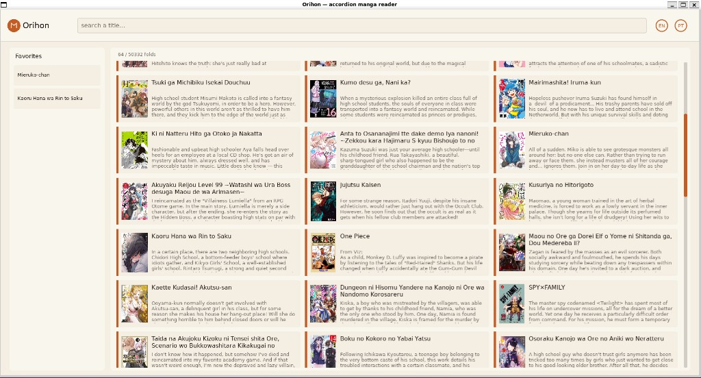

# Orihon

> Leitor desktop de mangá em **Lua + LÖVE**.  
> Catálogo pela [MangaDex API v5](https://api.mangadex.org/docs/03-manga/search/) (oficial, grátis).  
> UI de **orihon** (livro-acordeão): estante de dobras, ficha, leitura em *spread* RTL.  
> Spec-Driven + [BMad Method](https://github.com/bmad-code-org/BMAD-METHOD).



| | |
|--|--|
| Linguagem | Lua 5.1+ (LÖVE 11) |
| UI | LÖVE — washi, vermelhão, dobras |
| API | MangaDex v5 + MangaDex@Home |
| Persistência | `library.json` / `progress.json` no save dir |
| Fora de escopo | Manga Plus, paywall, Tauri, conteúdo adulto explícito |

## SDD (comece por aqui)

| Arquivo | Papel |
|---------|--------|
| [`.specify/SPEC.md`](.specify/SPEC.md) | **O quê** |
| [`.specify/PLAN.md`](.specify/PLAN.md) | **Como** |
| [`.specify/CONTEXT.md`](.specify/CONTEXT.md) | Estado atual |
| [`AGENTS.md`](AGENTS.md) | Briefing do agente |
| [`docs/GLOSSARY.md`](docs/GLOSSARY.md) | Termos para iniciante |
| [`docs/bmad/PROCESS.md`](docs/bmad/PROCESS.md) | Loop Clarify → Plan → Build → Learn |
| [`docs/adr/`](docs/adr/) | Porquês |
| [`docs/images/estante.jpg`](docs/images/estante.jpg) | Print da estante |

Se código e spec divergirem, a **spec manda**.

## Pré-requisitos

- [LÖVE 11](https://love2d.org/) (`love`)
- Lua 5.4 (só para testes)
- `curl`

```bash
# Debian/Ubuntu / WSL
sudo apt install love lua5.4 curl
```

## Como rodar

```bash
cd lua-orihon
lua5.4 tests/run.lua    # ou: lua tests/run.lua  (inclui contratos de performance CAP-7)
lua5.4 tests/live.lua   # smoke na API MangaDex (rede)
love .
```

Na estante: digite um título e **Enter**. A grade carrega mais obras ao **rolar** (barra à direita). Clique numa dobra para a ficha. O selo vermelho guarda na estante. Clique num capítulo para o spread. O logo **Orihon** volta à estante.

Não há botões no rodapé da home. Rodapé só onde falta navegação: **Back** na ficha; **Back / Prev / Next / Single** na leitura.

| Tecla | Ação |
|-------|------|
| `/` | Foco na busca |
| Enter | Buscar |
| Esc | Voltar |
| ← → | Páginas (RTL: a da **direita** é a atual) |
| D | Uma página só |
| Clique direita / esquerda | Avançar / voltar |
| EN / PT | Idioma do catálogo (`en` / `pt-br`) |

## Arquitetura

```
lua-orihon/
  AGENTS.md
  .specify/
  memory/
  docs/images/estante.jpg
  src/json.lua http.lua mangadex.lua persist.lua
  src/layout.lua jobs.lua download_thread.lua app.lua
  tests/run.lua perf.lua live.lua
```

HTTP usa `curl` **fora** da janela (3 workers em `src/jobs.lua`). Imagens vão para o save dir do LÖVE (`~/.local/share/love/orihon/` no Linux). `tests/perf.lua` falha se o `curl` voltar para `src/app.lua`.

## Licença de conteúdo

As obras pertencem aos autores/editoras listados na MangaDex. O Orihon só consome a API pública. Não redistribua páginas em cache.
